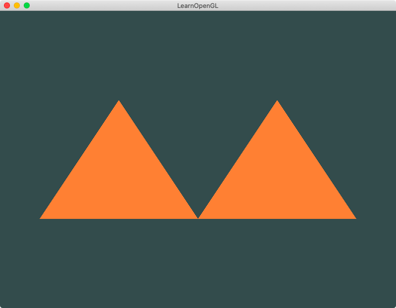

## Chapter 1 - The Basics
### Content Summary
This section covers chapters *5. Hello Triangle* and *6. Shaders* of [LearnOpenGL](https://learnopengl.com).

The examples in this chapter implement basic **OpenGL** functions. 

- In the examples, a window is set up (including a resize callback and a key to exit the program), the appropiate functions to initialise the environment are loaded and a simple **render loop** is implemented. 

- Each of the examples compile a **vertex shader** and a **fragment shader** and link them into a **shader program**. These  shaders work with **input** and **output** variables and **uniforms** to apply simple modifications over the graphics pipeline. 

- The examples also introduce the concepts of **Vertex Buffer Objects (VBOs)**, **Vertex Array Objects (VAOs)** and one of them makes use of an **Element Buffer Object (EBO)**.

### Examples
The examples can be executed one by one without needing to pass any arguments, the only example supporting an optional argument is [4. A basic rectangle](#4-a-basic-rectangle). The examples need to be launched from the root *build* folder so they can find the right path for the shaders. To exit the examples, just press <kbd>ESC</kbd>.

#### 1. A basic triangle
Implementation of a simple triangle usign a basic vertex shader that draws 3 vertices (defined in a **VBO** with its corresponding attributes in a **VAO**) and a fragment shader that colours the resulting triangle in orange.

<div align="center">
  <br>
  <sup><strong>Fig. 1: </strong> A basic (and orange) triangle</sup>
</div>

#### 2. Two basic triangles 
Similar to the previous example but with two triangles drawn as 6 vertices defined in a single VBO with the attributes specified in a VAO.

<div align="center">
  <br>
  <sup><strong>Fig. 2: </strong> Two basic (and orange) triangles</sup>
</div>

#### 3. Two independent triangles
In this example, each triangle has its vertices defined in a different VBO with a VAO for each. Two shader programs are used, each working with one of the VBOs through their respective VAOs. The two shader programs are linked against the same **vertex shader** but have different **fragment shaders**, one sets the colour orange for the first triangle while the other colours the second one in yellow.

<div align="center">
  <br>
  <sup><strong>Fig. 3: </strong> An orange and a yellow triangle</sup>
</div>

#### 4. A basic rectangle
This example introduces the usage of an **EBO** to specify the order in which to draw the unique vertices to avoid repeating vertices in the VBO for the two triangles that compose the rectangle. Executing this example with the option ```--no-fill``` draws the rectangle without any colour inside, making the two triangles that form the rectangle visible.

<div align="center">
  <br>
  <sup><strong>Fig. 4.1: </strong> A basic rectangle</sup>
</div>
<br>
<div align="center">
  <br>
  <sup><strong>Fig. 4.2: </strong> The rectangle's wireframe</sup>
</div>

#### 5. A triangle of a different colour
This example specifies the colour of the triangle in the vertex shader and passes it to the fragment shader so it can be applied as opposed to definining it in the fragment shader like in the previous examples. This is done to exemplify how variables can be send from one shader to another.

<div align="center">
  <br>
  <sup><strong>Fig. 5: </strong> A dark red triangle</sup>
</div>

#### 6. A chameleonic triangle
Here the concept of **uniforms** is introduced and applied to change the level of green in the triangle over time.

<div align="center">
  <br>
  <sup><strong>Fig. 6: </strong> A changing triangle</sup>
</div>

#### 7. A rainbow triangle
In this example, a colour for each vertex is defined in the VBO. With the help of another attribute in the VAO, a triangle with different colours is drawn. This example proves how the vertex attributes' values are interpolated so each and every pixel out of the rasterizer can have an appropriate value.

<div align="center">
  <br>
  <sup><strong>Fig. 7: </strong> A rainbow triangle</sup>
</div>

#### 8. A 'tipsy' triangle
Here, the triangle from the previous example is modified after some processing by the **vertex shader**: it negates the value of the *y* component of the input vertices and applies to the *x* component an offset read from an **uniform**.

<div align="center">
  <br>
  <sup><strong>Fig. 8: </strong> A drunk triangle</sup>
</div>

#### 9. A position-dependant-coloured triangle
In the last example of this chapter, the colour of the triangle is defined in the fragment shader directly from the position of each vertex. Because the bottom left corner of the image contains components with a negative value that get 'clamped' to 0 (the value is limited between 0 and 1), the output colour of that area is completely black.

<div align="center">
  <br>
  <sup><strong>Fig. 9: </strong> A triangle with not much colour</sup>
</div>
