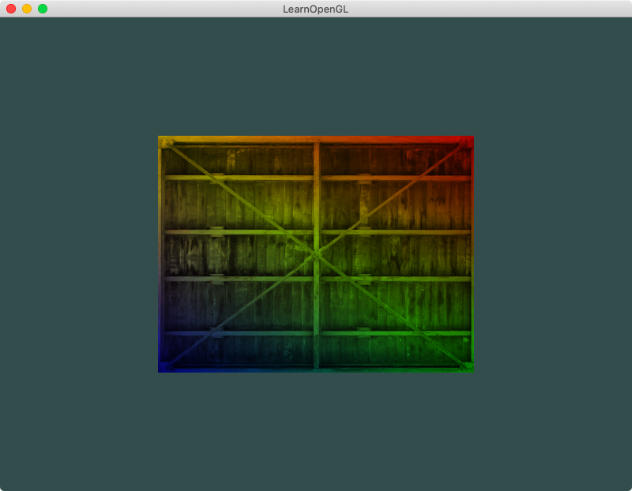
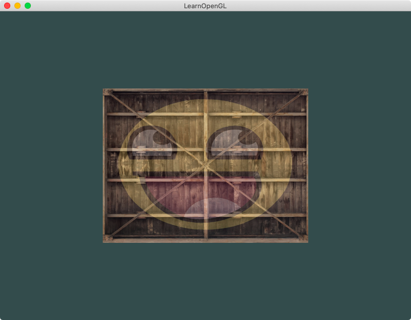
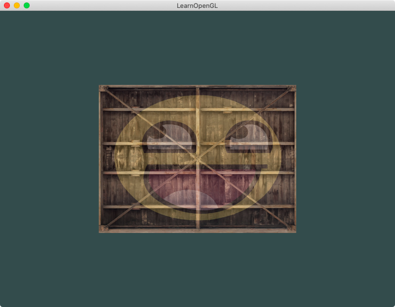
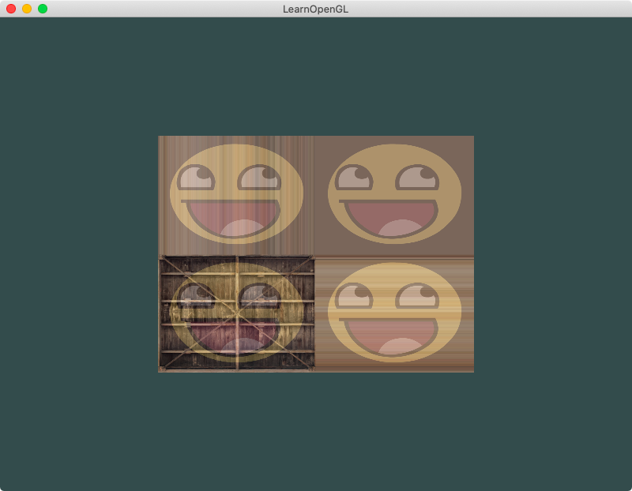
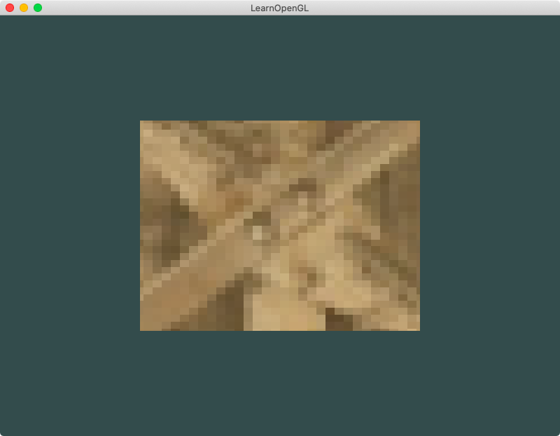

## Chapter 2 - Textures
### Content Summary
This section covers chapters *7. Textures* of [LearnOpenGL](https://learnopengl.com).

The examples in this chapter introduce how to work with textures in OpenGL. 

- Images are loaded to generate texture images that are then bound to **texture objects**. To set up the texture objects, the appropriate functions to configure **wrapping** and **filtering** modes and generate its **mipmap** levels are called. Then the texture coordinates for each vertex are included in the **VBO** along with the attribute's details in the **VAO**.

- In the **fragment shader**, the texture object is **sampled** to obtain the color of each pixel. In order to load multiple textures, the concept of **texture unit** is introduced.

### Examples
The examples can be executed one by one without needing to pass any arguments. They are not interactive except for the last one [6. Variable textures](#6-variable-textures). The examples need to be launched from the root *build* folder so they can find the right path for the shaders. To exit the examples, just press <kbd>ESC</kbd>.

#### 1. A rainbow container
This example gives a rectangle the appearence of a wooden container by attaching a texture to it. The texture is mixed with other values in the fragment shader to modify its look.

   
  <strong>Fig. 1: </strong> A funky wooden container

#### 2. A happy container
The container from the previous example is mixed with another texture with the help of the concept of **texture units**.

   
  <strong>Fig. 2: </strong> A happy wooden container

#### 3. A happy container looking around
This is similar to the previous example, but the texture of the happy face is reversed on the *X* axis by modfying the behaviour of the **fragment shader**.

   
  <strong>Fig. 3: </strong> The happy container again, but look over there!

#### 4. A glitched container
In this example, both textures appear four times. The original is located at the bottom left corner of the container but, by setting different **warpping modes**, the container is clamped at the edges while the face merely repeats itself four times.

   
  <strong>Fig. 4: </strong> More faces and weird textures

#### 5. Look at the pixel
This example only uses the center of the textures for the whole rectangle by changing the texture coordinates for each vertex, making the pixels visible by changing the **filtering mode** to *nearest neighbour*.

   
  <strong>Fig. 5: </strong> This is too close!

#### 6. Variable textures
In this example, the weight applied for each texture when mixed in the **fragment shader** is an uniform. The value can be modified by pressing <kbd>&#9650;</kbd> and <kbd>&#9660;</kbd>.

   
  <strong>Fig. 6: </strong> Texture transitions

