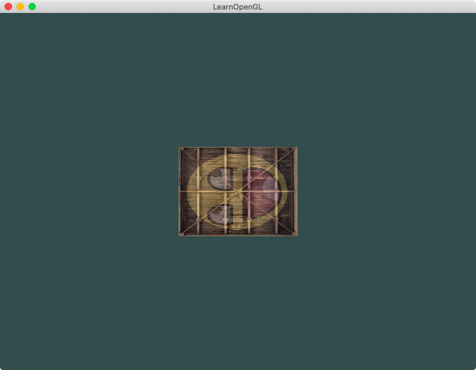
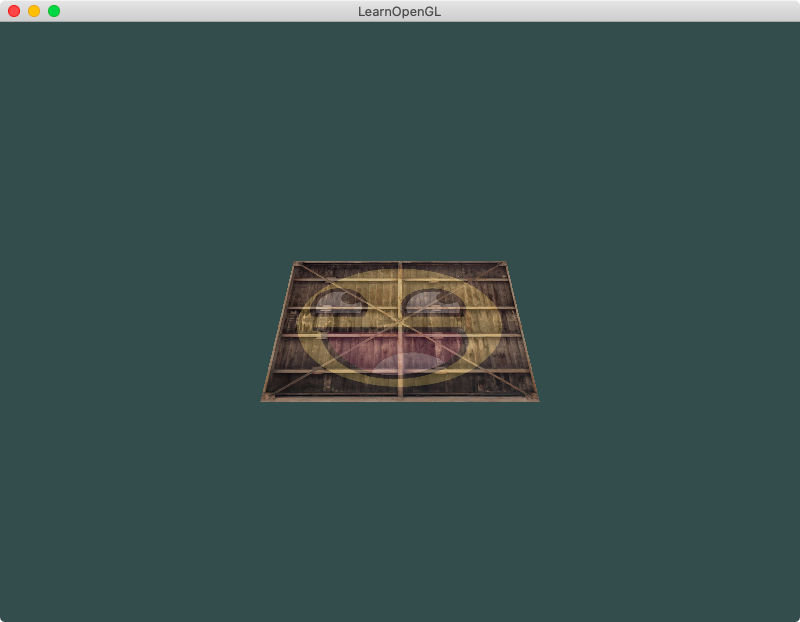
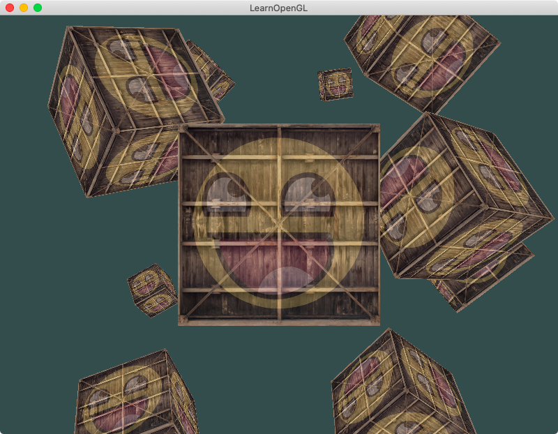
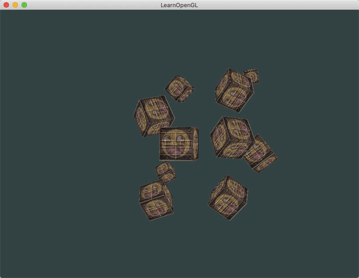

## Chapter 3 - Space
### Content Summary
This section covers chapters *8. Transformations*, *9. Coordinate System* and *10. Camera* of [LearnOpenGL](https://learnopengl.com).

The examples in this section show how to perform **space transformations** on objects in OpenGL.

- The concept of transformation matrices is introduced to apply **translations**, **rotations** and **scaling**. These **matrix objects** are passed to the **fragment shader** as **uniforms** to modify the generated objects.

- These transformations are used to convert from the **local space** to the **screen space** in the **vertex shader**. Three type of matrices are applied with their corresponding intermediate space:
  - The **model** matrix to convert to the **world space**.
  - The **view** matrix to convert to the **view space**.
  - The **projection** matrix to convert to the **clip space**.
    - There are two types of projections: **orthographic** (accurate dimensions) and **perspective** (realistic).
  - The final transformation is a **viewport transform** to the **screen** space.

 - The concept of **depth testing** using the **Z-buffer** (or **depth buffer**) is also introduced to understand how OpenGL decides to display which fragments depending on their position and how some of them are hidden by others.

 - Even if there is no concept of **camera** in OpenGL, the examples show how it can be simulated with the **view** matrix by moving the **world space** in the opposite direction. This can be achieved by using a **LookAt** matrix defined with **position**, **target** and **orientation** vectors. **Euler's angles** (**pitch**, **yaw** and **roll**) help defining the direction vector.

 - It is also shown how a **zooming** effect can be simulated modifying the **Field of View (FoV)** of the **perspective** matrix.

### Examples
The examples can be executed one by one without needing to pass any arguments, the only examples supporting an optional argument are [2. A moving container](#2-a-moving-container), [6. Some more 3D containers](#6-some-more-3D-containers) and [8. A free camera](#9-a-free-camera). The examples need to be launched from the root *build* folder so they can find the right path for the shaders. To exit the examples, just press <kbd>ESC</kbd>.

#### 1. A fallen container
In this example, the container from the previous chapter appears reduced to half the size after applying a **scaling** transformations and turned to the left after a **rotation**.

<div align="center">
  <br>
  <sup><strong>Fig. 1: </strong> The container fell on its side</sup>
</div>

#### 2. A moving container
This example applies a **rotation** on the *Z* axis that varies over time and then a **translation** to move the container to the bottom right corner of the screen. Executing this example with the option ```--orbit``` applies the **translation before** the **rotation** and the container looks like it is orbiting around the centre.

<div align="center">
  <br>
  <sup><strong>Fig. 2.1: </strong> A container rotating</sup>
</div>
<br>
<div align="center">
  <br>
  <sup><strong>Fig. 2.2: </strong> A container orbiting</sup>
</div>

#### 3. Two dancing containers
This example draws the container two times. The one on the bottom right corner is the previous rotating container, while the second one is being **scaled** with different values over time before a translation to the top left corner of the screen is applied to it.

<div align="center">
  <br>
  <sup><strong>Fig. 3: </strong> Two containers having a party</sup>
</div>

#### 4. A (flat) container lying *somewhere*
In this example, a **model**, a **view** and a **projection** matrix are created and passed to the vertex shader as uniforms to apply transformations on the container used in previous examples.

<div align="center">
  <br>
  <sup><strong>Fig. 4: </strong> The container was flat all along!</sup>
</div>

#### 5. A real 3D container
This example builds a real 3D container with 6 faces and makes it rotate by modifying the **model** matrix over time.

<div align="center">
  <br>
  <sup><strong>Fig. 5: </strong> A rotating 3D container</sup>
</div>

#### 6. Some more 3D containers
In this example, the previous object is rendered 10 times in different positions by applying a different **model** matrix each time. If the example is executed with the option ```--rotate```, 4 of the cubes have their model matrix modified over time to rotate.

<div align="center">
  <br>
  <sup><strong>Fig. 6.1: </strong> A container reunion in 3D</sup>
</div>
<br>
<div align="center">
  <br>
  <sup><strong>Fig. 6.2: </strong> Some containers can never stand still</sup>
</div>

#### 7. Moving around
A 'camera' rotating around the scene of the previous example is simulated when the position of a **LookAt** matrix used as **view** matrix changes over time.

<div align="center">
  <br>
  <sup><strong>Fig. 7: </strong> Looking around the scene</sup>
</div>

#### 8. A free camera
This example implements a 'camera' that can be controlled with the **mouse** and **keyboard** (<kbd>W<kbd><kbd>A<kbd><kbd>S<kbd><kbd>D<kbd> keys) and flies freely around the scene with a **zooming** option also available. If the example is executed with the option ```--fps```, the height of the 'camera' remains constant.

<div align="center">
  <br>
  <sup><strong>Fig. 8.1: </strong> A free camera between containers</sup>
</div>
<br>
<div align="center">
  <br>
  <sup><strong>Fig. 8.2: </strong> A step closer to an FPS</sup>
</div>
