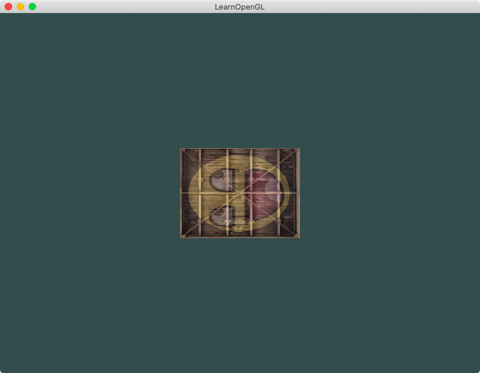

## Chapter 3 - Transformations
### Content Summary
This section covers chapters *8. Transformations* and **_[TO BE COMPLETED]_** of [LearnOpenGL](https://learnopengl.com).

The examples in this chapter show how to **transform** objects in OpenGL. 

- The concept of transformation matrices is introduced to apply **translations**, **rotations** and **scaling**. These **matrix objects** are passed to the **fragment shader** as **uniforms** to modify the generated objects.

### Examples
The examples can be executed one by one without needing to pass any arguments, the only example supporting an optional argument is [2. A moving container](#2-a-moving-container). The examples need to be launched from the root *build* folder so they can find the right path for the shaders. To exit the examples, just press <kbd>ESC</kbd>.

#### 1. A fallen container
In this example, the container from the previous chapter appears reduced to half the size after applying a **scaling** transformations and turned to the left after a **rotation**.

<div align="center">
  <br>
  <sup><strong>Fig. 1: </strong> The container fell on its side</sup>
</div>


#### 2. A moving container
This example applies a **rotation** on the *Z* axis that varies over time and then a **translation** to move the container to the bottom right corner of the screen. Executing this example with the option ```--orbit``` applies the **translation before** the **rotation** and the container looks like it is orbiting around the centre.

<div align="center">
  <br>
  <sup><strong>Fig. 2.1: </strong> A container rotating</sup>
</div>
<br>
<div align="center">
  <br>
  <sup><strong>Fig. 2.2: </strong> A container orbiting</sup>
</div>

#### 3. Two dancing containers
This example draws the containers two times. The one on the bottom right corner is the previous rotating container, while the second one is beign **scaled** with different values over time before a translation to the top left corner of the screen is applied to it.

<div align="center">
  <br>
  <sup><strong>Fig. 3: </strong> Two containers having a party</sup>
</div>

