## Chapter 4 - Lighting
### Content Summary
This section covers chapters *12. Colors*, *13. Basic Lighting*, *14. Materials*, *15. Lighting Maps*, *16. Light Casters* and *17. Multiple Lights* of [LearnOpenGL](https://learnopengl.com).

The examples in this section show how to apply **lighting** on objects in OpenGL.

- The perceived color of an object can be interpreted as a combination of the **light's color** and the **object's color** (as in how much of the light's components an object reflects).

- In OpenGL, the **Phong lighting model** is a common model used to implement lighting. It is based on 3 components:
  - **Ambient** lighting: it affects the whole object.
  - **Diffuse** lighting: calculated as the dot product between the **light's direction vector** and the **normal vector** of the surface (perpendicular to the fragment's surface).
  - **Specular** lighting: calculated as the dot product between the **light's reflection vector** around the normal vector of the surface and the **view direction** (from the origin in view space).

- If the calculations are done in the view space, it is needed to translate the normal vectors from world space. To do this, a special matrix called the **normal matrix** (which is the **transpose of the inverse** of the view or view-model matrix) needs to be applied to them.

- Different materials have different **ambient**, **diffuse** and **specular** color vectors, as well as different **shininess** (the way the light is scattered over the object's surface).

- For objects with different materials that react differently to light, **lighting maps** (which are basically **textures** for lit scenes) are used. Usually a **diffuse map** is used for **ambient** and **diffuse** components, while a **specular map** (most of the times a black-and-white texture) is used for the **specular** component.

- There are different types of **light casters** that can be simulated in OpenGL and mainly affect the **diffuse** and **specular** components:
  - **Directional light**: the light comes from a **unique** direction and it only requires a **direction vector** to be calculated.
  - **Point light**: the light comes form a source that illuminates in **all directions**. Usually the light **attenuates** with the inverse of the quadratic value of the **distance** between the fragment and the source.
  - **Spotlight**: the light only illuminates in a **specific direction** and can also be defined with the **position** and **direction** of the source and a **cutoff angle** (everything outside the angle remains dark).
    - To simulate a **flashlight**, an **outer cutoff angle** can be defined to specify a **transition zone** where the light's intensity decreases as it moves away from the centre.

- All the previously mentioned lights can be **combined** in the **fragment shader** adding the contribution of each of them to the **output color** of the fragment.

### Examples
The examples can be executed one by one without needing to pass any arguments, the only examples supporting an optional argument are [2. The Phong lighting model](#2-the-phong-lighting-model), [7. Lighting maps](#7-lighting-maps) and [13. Lit scenes](#13-lit-scenes). The examples need to be launched from the root *build* folder so they can find the right path for the shaders. To exit the examples, just press <kbd>ESC</kbd>.

#### 1. A dull scene
This example simply sets up the scene that will be used on the following examples: an **orangish cube** that will be lighten-up in the following examples and a smaller **white cube** close to it and slightly above that will represent the light source in those examples.

<div align="center">
  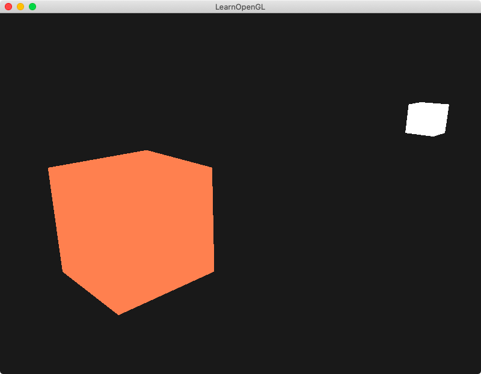<br>
  <sup><strong>Fig. 1: </strong> Nothing to see here </sup>
</div>

#### 2. The Phong lighting model
This example shows the **Phong lighting model** in action with its **ambient**, **diffuse** and **specular** components applied to the cube. Executing this example with the option ```--orbit``` changes the position of the light over time and the lighting effects can be seen more clearly.

<div align="center">
  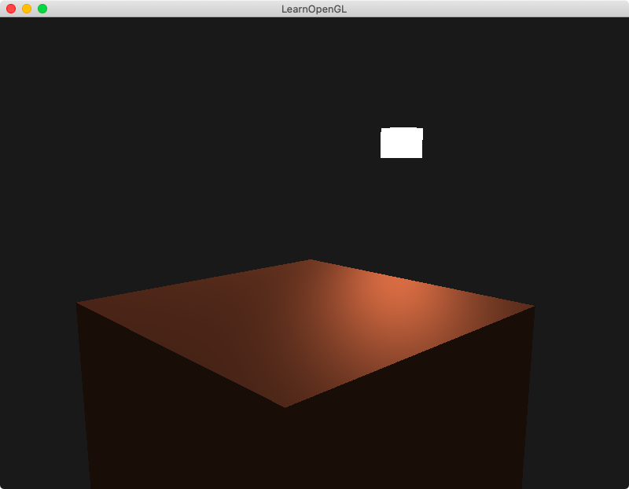<br>
  <sup><strong>Fig. 2.1: </strong> The top of a brightened-up cube </sup>
</div>
<br>
<div align="center">
  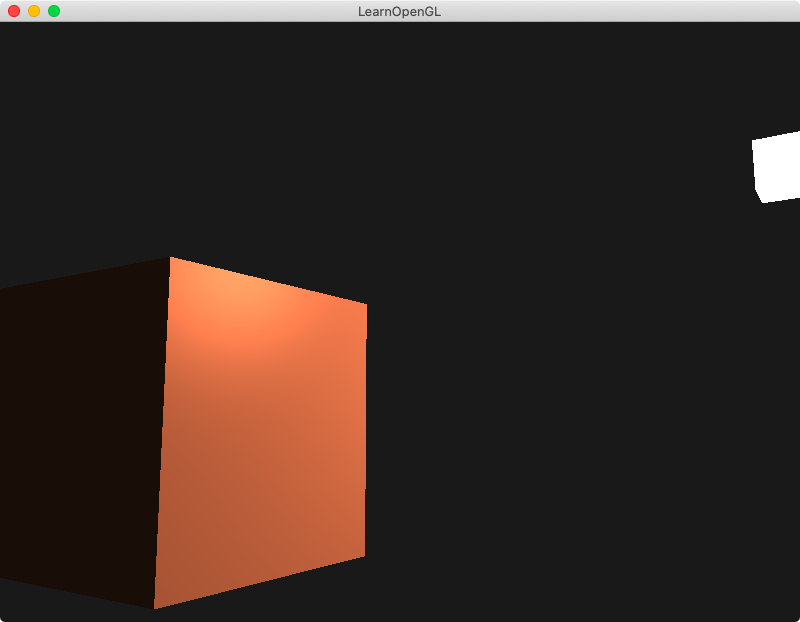<br>
  <sup><strong>Fig. 2.2: </strong> One side of a brightened-up cube </sup>
</div>
<br>
<div align="center">
  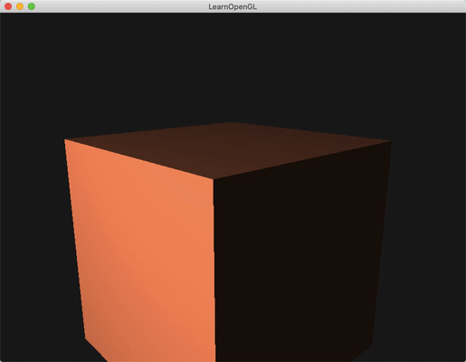<br>
  <sup><strong>Fig. 2.3: </strong> A lamp orbiting a cube </sup>
</div>

#### 3. Same but different
In this example, the calculations are done in the **view space** instead of the **world space** but the visible results are exactly the same.

<div align="center">
  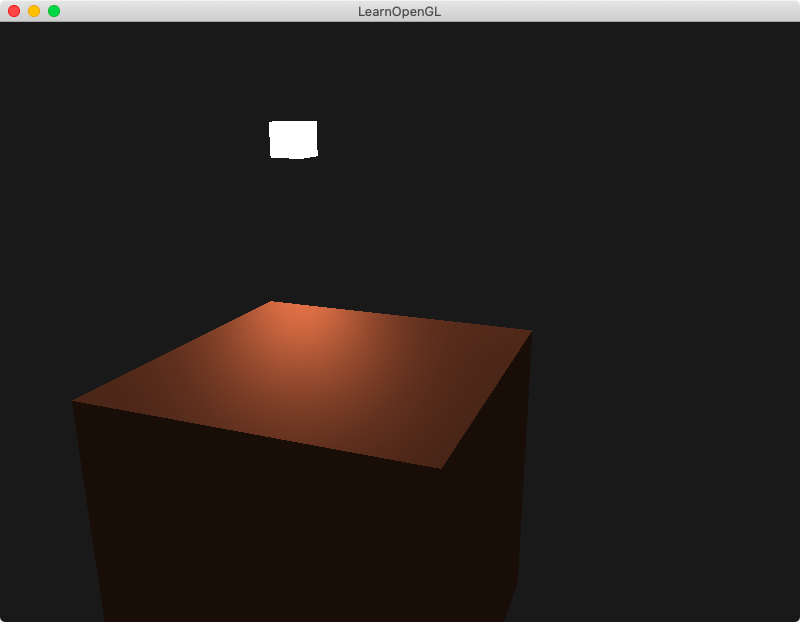<br>
  <sup><strong>Fig. 3: </strong> The scene remains the same </sup>
</div>

#### 4. The Gouraud shading
This example implements the **Gouraud shading**, which is nothing more than the Phong lighting model calculated in the **vertex shader** instead of the fragment shader. It shows how the results are less realistic (although the calculations are done more efficiently) as there is a visible **stripe** in the union between the two triangles that from each side of the cube, as the lighting value of those fragments has been **interpolated** from the lighting values of the vertices.

<div align="center">
  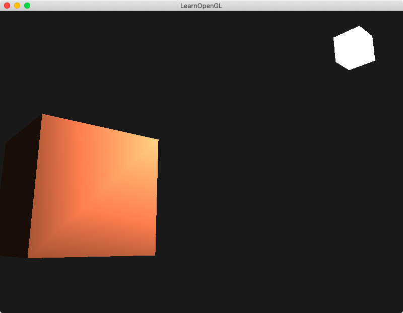<br>
  <sup><strong>Fig. 4: </strong> Something odd is happening here </sup>
</div>

#### 5. Disco lights
In this example, the light color changes over time, with different values for its **ambient** and **diffuse** color vectors (they both share the same color but the ambient component is dimmer), while the light source's color also changes with them. It makes visible how the cube reacts differently to changes in lighting conditions.

<div align="center">
  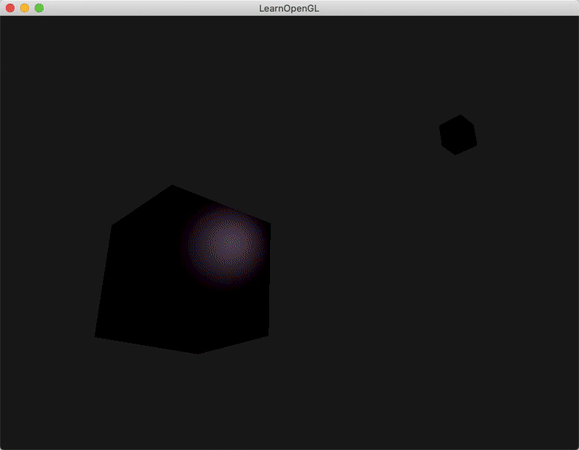<br>
  <sup><strong>Fig. 5: </strong> The cube reacts to different color lights </sup>
</div>

#### 6. A plastic cube
This example shows how the object's **ambient**, **diffuse** and **specular** components can be changed (while a white light is used) to make the material resemble cyan plastic.

<div align="center">
  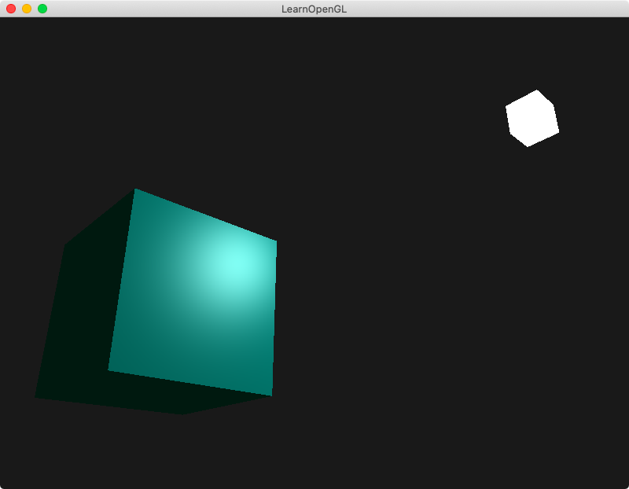<br>
  <sup><strong>Fig. 6: </strong> This cube is made of cyan plastic (or at least looks like it) </sup>
</div>

#### 7. Lighting maps
In this example, lighting maps are used to simulate a wooden container with a steel border. The color is set according to a **diffuse map** and the reflective properties of the steel are defined with a **specular map** containing white values for the most reflective parts. If the example is executed with the option ```--color```, a colored specular map is used for the steel border.

<div align="center">
  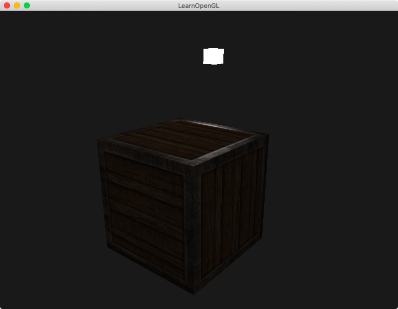<br>
  <sup><strong>Fig. 7.1: </strong> Different materials reacting differently to light </sup>
</div>
<br>
<div align="center">
  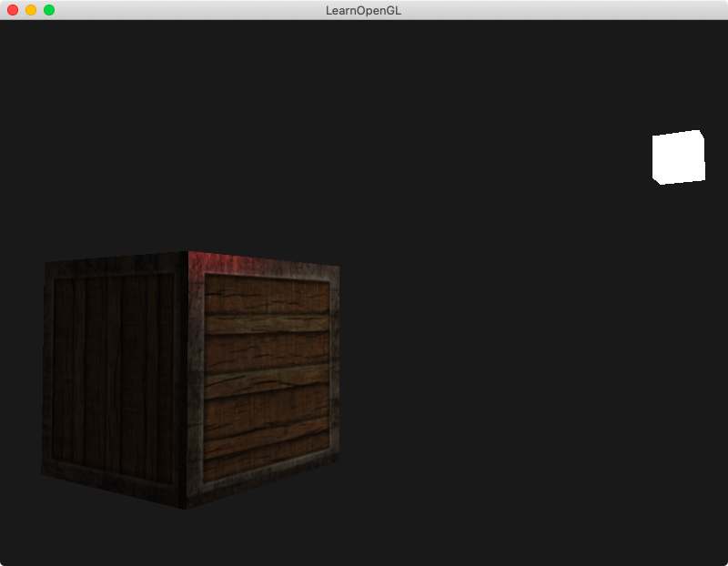<br>
  <sup><strong>Fig. 7.2: </strong> The steel here is not very realistic </sup>
</div>

#### 8. Emission maps
An **emission map** is added to the container of the previous example, simulating a texture that 'glows' regardless of lighting conditions.

<div align="center">
  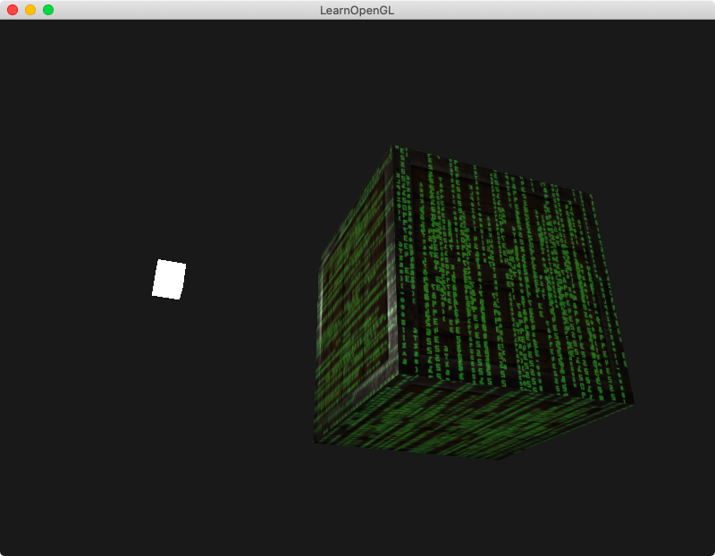<br>
  <sup><strong>Fig. 8: </strong> A movie reference </sup>
</div>

#### 9. Directional light
In this example, **directional light** is set up over a group of containers and it can be seen how only some sides are illuminated while others remain darker.

<div align="center">
  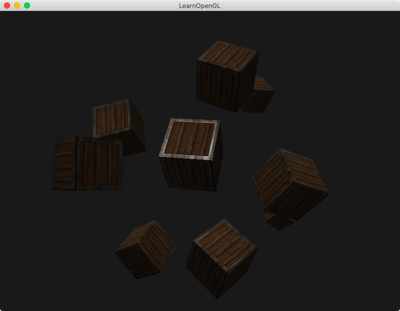<br>
  <sup><strong>Fig. 9: </strong> Light from above </sup>
</div>

#### 10. Point light
This example simulates the group of containers illuminated by a **point light**. The light intensity is **attenuated** for the containers that are farther away from the light source.

<div align="center">
  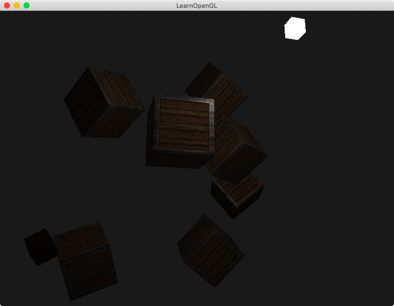<br>
  <sup><strong>Fig. 10: </strong> A lamp for the containers </sup>
</div>

#### 11. Spotlight
In this example, a **spotlight** with its source set in the position of the camera (same position and direction vectors as the camera's) is represented.

<div align="center">
  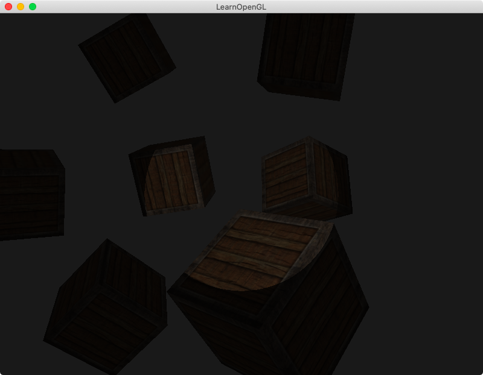<br>
  <sup><strong>Fig. 11: </strong> A spotlight </sup>
</div>

#### 12. Flashlight
This example improves the last one and simulates a realistic **flashlight** setting a **smooth edge** for the spotlight by defining a **transition zone** between an inner and outer **cutoff angle**.

<div align="center">
  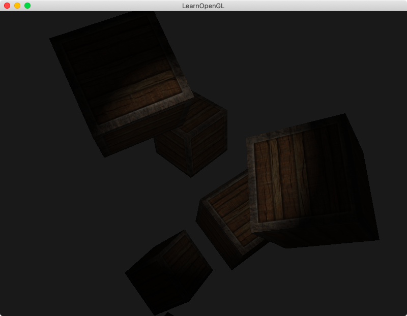<br>
  <sup><strong>Fig. 12: </strong> Uuuhh... spooky </sup>
</div>

#### 13. Lit scenes
In the last example, all the previous components and light casters are **combined** to recreate full atmospheres. The example can be executed with the options ```--desert```, ```--factory```, ```--horror``` or ```--lab```. Each of them having a different combination of colors and light intensities with the objective of recreating characteristic ambiences.

<div align="center">
  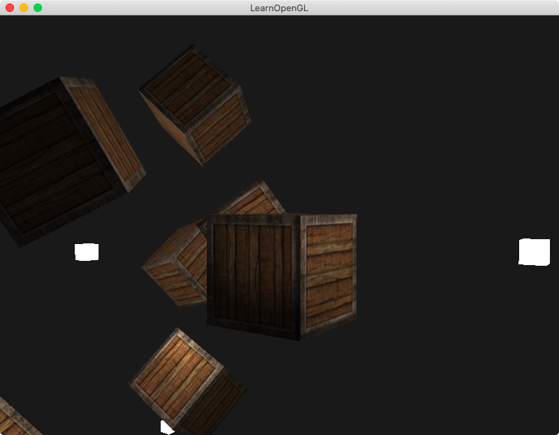<br>
  <sup><strong>Fig. 13.1: </strong> Regular lighting conditions </sup>
</div>
<br>
<div align="center">
  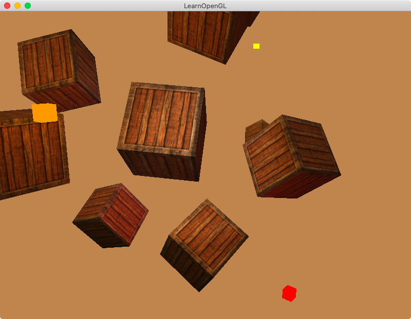<br>
  <sup><strong>Fig. 13.2: </strong> A scorching desert </sup>
</div>
<br>
<div align="center">
  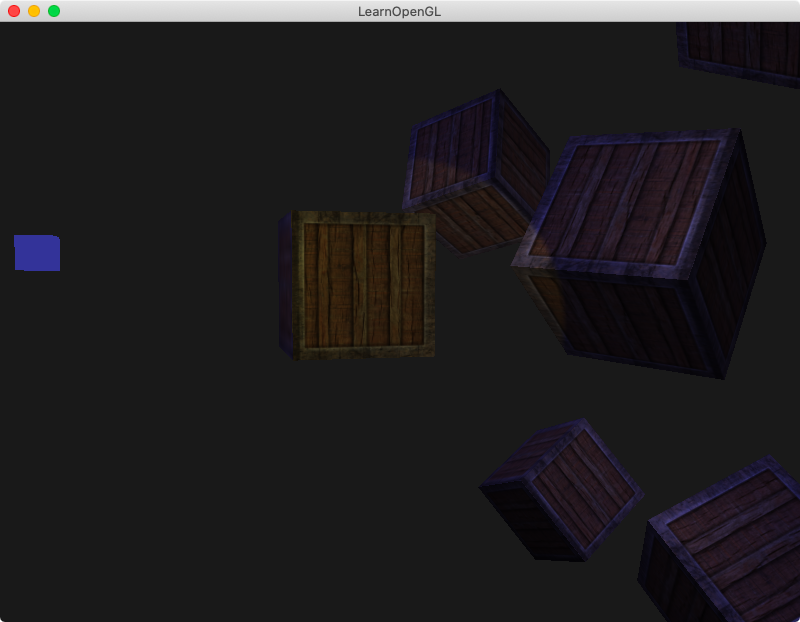<br>
  <sup><strong>Fig. 13.3: </strong> An abandoned factory </sup>
</div>
<br>
<div align="center">
  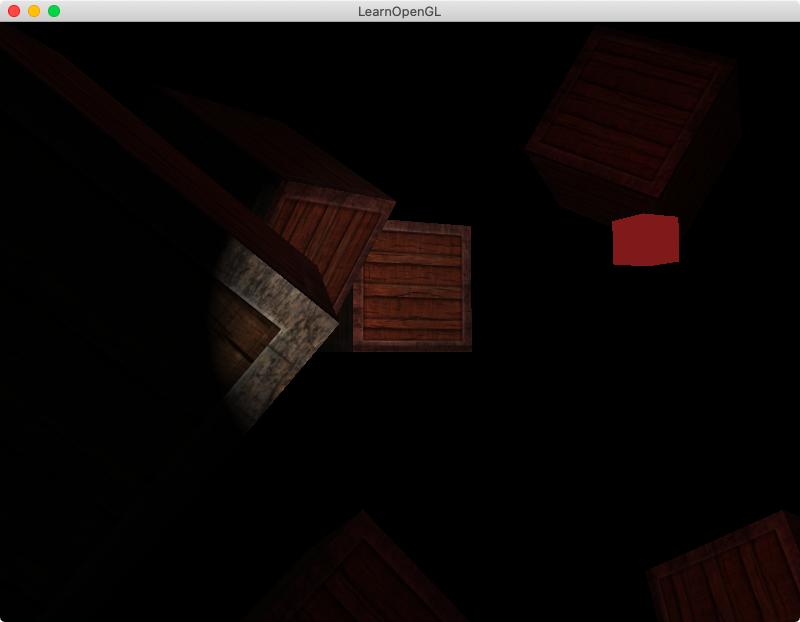<br>
  <sup><strong>Fig. 13.4: </strong> Something eerie is around </sup>
</div>
<br>
<div align="center">
  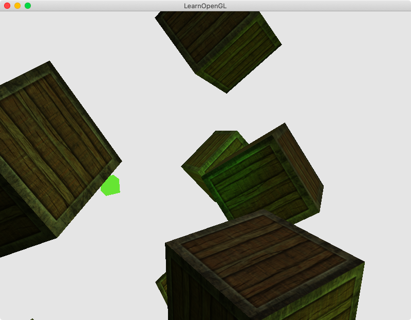<br>
  <sup><strong>Fig. 13.5: </strong> Nothing good will come out of this lab </sup>
</div>
