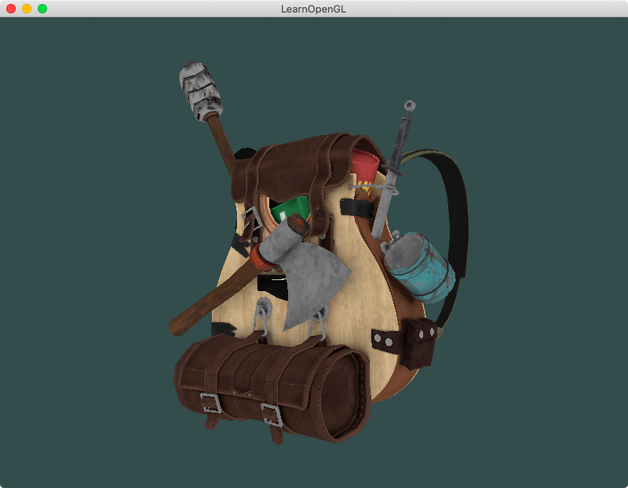
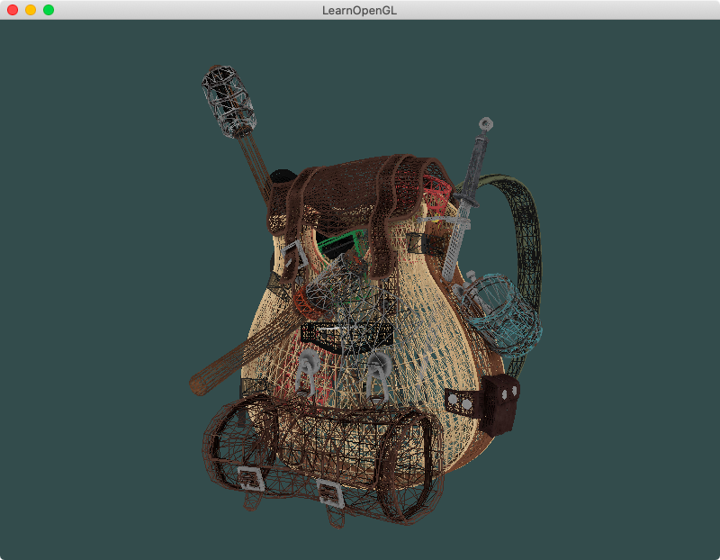
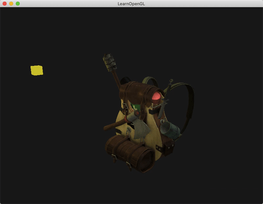

## Chapter 5 - Model Loading
### Content Summary
This section covers chapters *19. Assimp*, *20. Mesh* and *21. Model* of [LearnOpenGL](https://learnopengl.com).

The examples in this section show how to load **models** designed by other 3D artists in OpenGL.

- 3D artists use **3D modelling** tools to design models and apply textures to them (**uv-modelling**). OpenGL can read the generated vertex, normals and texture coordinates and draw these objects.

- Models can be stored in different file types. The **Open Asset Import Library (Assimp)** can work with many of them and load models into a generalised data structure:
    - The model is loaded in a **scene** object that points to a **root node**, an array of **mesh** objects and an array of **materials**.
    - Each **node** is composed of **mesh objects** (minimal drawable objects) and **child nodes**.
    - Each **mesh** contains **vertex** data, **normals**, **texture coordinates**, several **faces** (indices for the vertices) and an **index** to the **array of materials**.
    - The **material objects** contain the location of **lighting maps**.

### Examples
The examples can be executed one by one without needing to pass any arguments, the only example supporting an optional argument is [1. A model](#1-a-model). The examples need to be launched from the root *build* folder so they can find the right path for the shaders. To exit the examples, just press <kbd>ESC</kbd>.

#### 1. A model
This example simply loads a model from a file and draws it. If the example is executed with the option ```--no-fill``` the model is drawn in **wireframe** mode.

<div align="center">
  <br>
  <sup><strong>Fig. 1.1: </strong> A guitar backpack </sup>
</div>
<br>
<div align="center">
  <br>
  <sup><strong>Fig. 1.2: </strong> A nude model </sup>
</div>

#### 2. Model and light
In this example, the previous model is drawn again but now with lighting conditions applied: **directional light**, a **point light** that orbits around the object and a **flashlight** from the location of the camera.

<div align="center">
  <br>
  <sup><strong>Fig. 2: </strong> Cast some light </sup>
</div>

