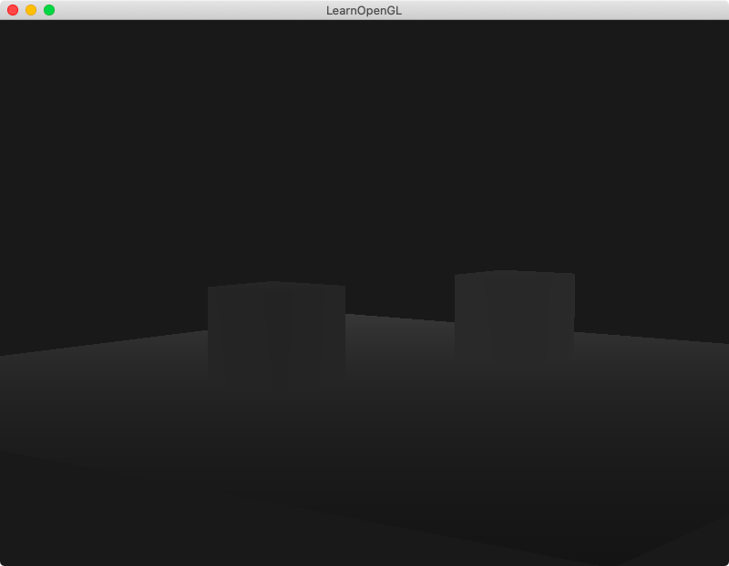
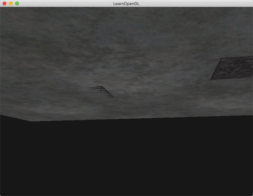
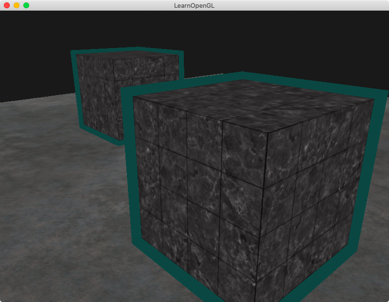
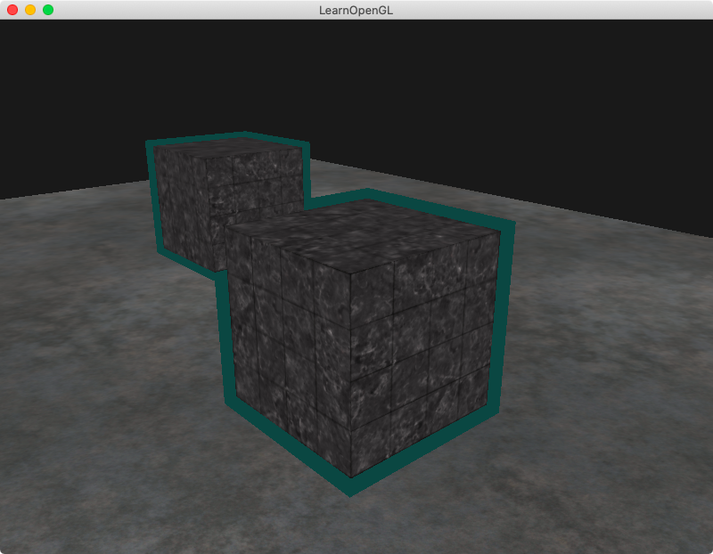
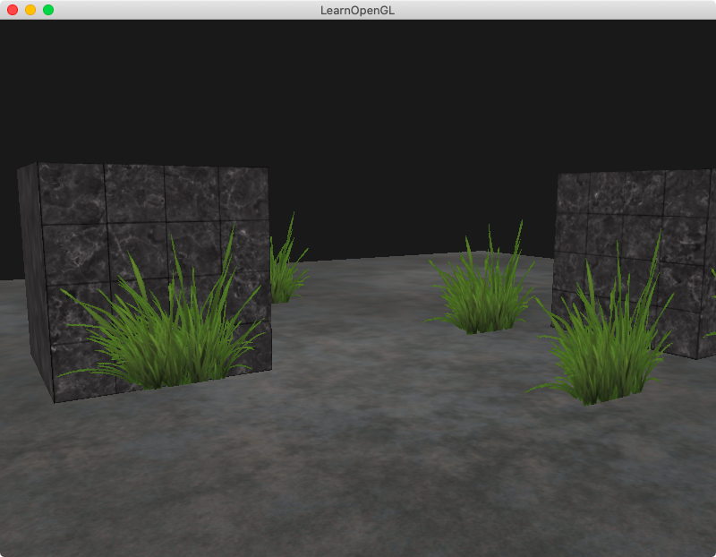
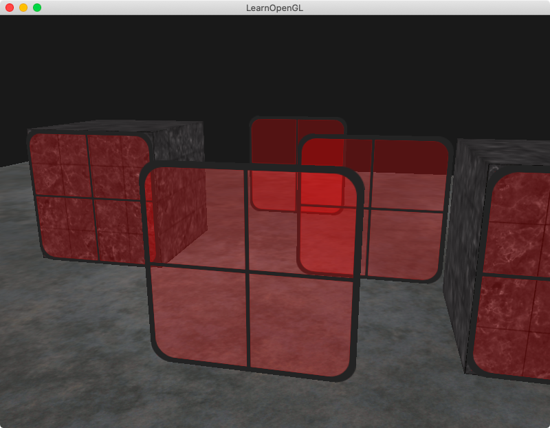
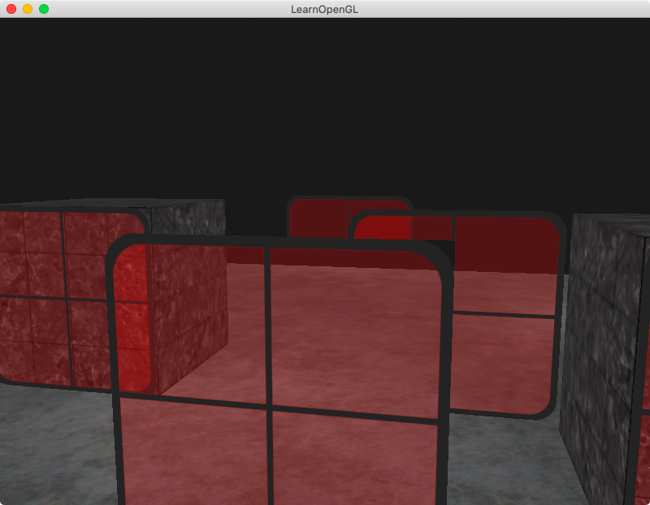
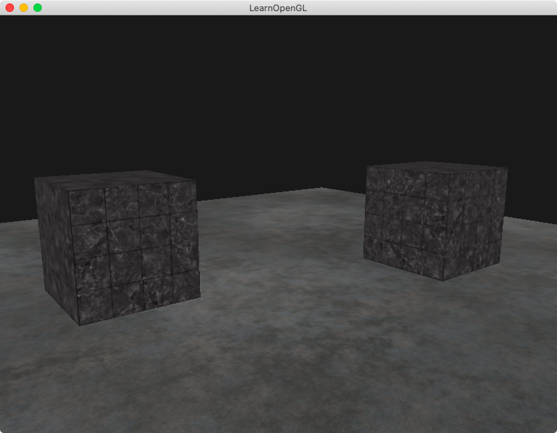

## Chapter 5 - Advanced Features
### Content Summary
This section covers chapters *22. Depth Testing*, *23. Stencil Testing*, *24. Blending*, *25. Face Culling* and **_[TO BE COMPLETED]_** of [LearnOpenGL](https://learnopengl.com).

The examples in this section show different *advanced* features of OpenGL.

- **Depth testing** is used to determine if a fragment is visible or hidden by others. OpenGL keeps a **depth buffer** and compares each fragment's depth value against the content of the depth buffer to perform the test.
    - The depth buffer values are in the range [0.0, 1.0]. From **view space** the conversion is done relatively to the **near (0.0)** and **far (1.0)** planes, usually proportional to **1/z** to give more precision to the objects that are closer to the viewer.
    - If the depth test cannot figure out which fragment is in front of the other, a glitch called **z-fighting** can appear. This can happen, for example, when two different shapes are in the same plane.

- **Stencil testing** is used to discard fragments while rendering. It is done based on the content of the **stencil buffer** (usually an 8-bit buffer) and performed after the fragment is processed in the **fragment shader** but before **depth testing**. A common approach is to write to the buffer while rendering some objects and then conditionally render some fragments of the following objects based on the content of the buffer.

- For textures that don't have a solid color but some **transparency** (**alpha** value less than 1.0), **blending** needs to be applied. Different **factors** can be used for the **destination** color vector (the one already in the **color buffer**) and the **source** color vector (new fragment's one) to perform the blending. A **constant color vector** can also be added into the mix to have more control of the proportions.
    - To correctly render transparent objects so other objects that are behind them can be seen, it is necessary to render them in other from the ones in the **background** to the ones in the **foreground** so they can pass the depth test. There are other techniques to solve this potential issue, like **order independent transparency**.
    - If it is only required to **show** parts of a texture and **ignore** others, the fragments can be directly **discarded** in the **fragment shader** using an alpha value as threshold.

- When **face culling** is enabled, OpenGL can discard (cull) back-facing faces of shapes as they are assumed they will not be visible. This can only be done when **closed shapes** have a consistent **winding order**. By default, **front-facing** faces are defined with their vertices in **counter-clockwise** order; while for **back-facing** ones, they are in **clockwise** order. If the viewer changes positions and looks at a face from the other side, the order for rendering the vertex data changes, and OpenGL can act accordingly **optimizing** the process.

### Examples
The examples can be executed one by one without needing to pass any arguments, the only examples supporting an optional argument are [1. Depth testing](#1-depth-testing), [2. Stencil testing](#2-stencil-testing) and [4. Blending](#4-blending). The examples need to be launched from the root *build* folder so they can find the right path for the shaders. To exit the examples, just press <kbd>ESC</kbd>.

#### 1. Depth testing
This example shows the effect of different settings related to **depth testing**. If the example is executed with the option ```--disable```, no depth testing is performed. When the option is ```--visible```, the depth value of each fragment is displayed as a colour with values closer to 0.0 appearing black and values closer to 1.0, white.

<div align="center">
  <br>
  <sup><strong>Fig. 1.1: </strong> No depth testing </sup>
</div>
<br>
<div align="center">
  <br>
  <sup><strong>Fig. 1.2: </strong> Values of z (from afar) </sup>
</div>
<br>
<div align="center">
  <br>
  <sup><strong>Fig. 1.3: </strong> Z-fighting </sup>
</div>

#### 2. Stencil testing
In this example, **stencil testing** is used to to display **object outlining**. It shows a colored border over the two cubes from the previous example. The borders are drawn independently unless the example is executed with the option ```--merge-borders```; for that case, they are merged for the views in which both cubes overlap.

<div align="center">
  <br>
  <sup><strong>Fig. 2.1: </strong> To each of their own </sup>
</div>
<br>
<div align="center">
  <br>
  <sup><strong>Fig. 2.2: </strong> Merged borders </sup>
</div>

#### 3. Discarding fragments
This example places some textures representing grass around the scene. The grass is loaded as a squared image with **transparency**. The **fragment shader** discards the texels with an **alpha value** close to 0.0 effectively only rendering the grass.

<div align="center">
  <br>
  <sup><strong>Fig. 3: </strong> Some wildlife </sup>
</div>

#### 4. Blending
In this example, **blending** is applied to display red windows (translucent textures). If the example is executed with the option ```--no-order```, the windows are not rendered from background to foreground and the **depth test** fails for the ones drawn after the ones in front of them.

<div align="center">
  <br>
  <sup><strong>Fig. 4.1: </strong> A red district </sup>
</div>
<br>
<div align="center">
  <br>
  <sup><strong>Fig. 4.2: </strong> Not much transparency this way </sup>
</div>

#### 5. Face culling
This example has **face culling** enabled and because all the triangles are consistently defined by their vertices in counter-clockwise order for front-facing ones, back-facing faces are not being rendered without affecting what the the viewer can see.

<div align="center">
  <br>
  <sup><strong>Fig. 5: </strong> The changes are not visible, and that's the point! </sup>
</div>
