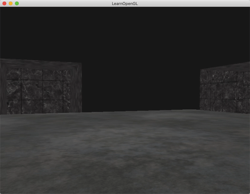

## Chapter 5 - Advanced Features
### Content Summary
This section covers chapters *22. Depth Testing*, *22. Stencil Testing* and **_[TO BE COMPLETED]_** of [LearnOpenGL](https://learnopengl.com).

The examples in this section show different *advanced* features of OpenGL.

- **Depth testing** is used to determine if a fragment is visible or hidden by others. OpenGL keeps a **depth buffer** and compares each fragment's depth value against the content of the depth buffer to perform the test.
    - The depth buffer values are in the range [0.0, 1.0]. From **view space** the conversion is done relatively to the **near (0.0)** and **far (1.0)** planes, usually proportional to **1/z** to give more precision to the objects that are closer to the viewer.
    - If the depth test has cannot figure out which fragment is in front of the other, a glitch called **z-fighting** can appear. This can happen, for example, when two different shapes are in the same plane.

### Examples
The examples can be executed one by one without needing to pass any arguments, the only example supporting an optional argument is [1. Depth testing](#1-depth-testing). The examples need to be launched from the root *build* folder so they can find the right path for the shaders. To exit the examples, just press <kbd>ESC</kbd>.

#### 1. Depth testing
This example shows the effect of different settings related to **depth testing** it. If the example is executed with the option ```--disable``` no depth testing is performed. When the option is ```--visible```, the depth value of each fragment is displayed as a colour with values closer to 0.0 appearing black and values closer to 1.0, white.

<div align="center">
  <br>
  <sup><strong>Fig. 1.1: </strong> No depth testing </sup>
</div>
<br>
<div align="center">
  <br>
  <sup><strong>Fig. 1.2: </strong> Values of z (from afar) </sup>
</div>
<br>
<div align="center">
  <br>
  <sup><strong>Fig. 1.3: </strong> Z-fighting </sup>
</div>

#### 2. Stencil testing
