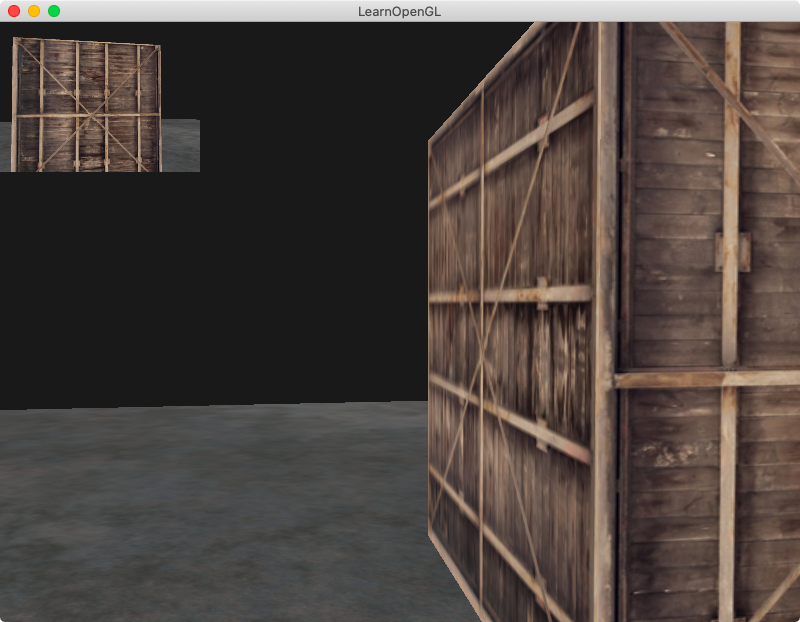

## Chapter 6 - Buffers
### Content Summary
This section covers chapters *22. Depth Testing*, *23. Stencil Testing*, *24. Blending*, *25. Face Culling*, *26. Framebuffers* and *27. Cubemaps* of [LearnOpenGL](https://learnopengl.com).

The examples in this section cover different buffers of OpenGL and what can be done with them.

- **Depth testing** is used to determine if a fragment is visible or hidden by others. OpenGL keeps a **depth buffer** and compares each fragment's depth value against the content of the depth buffer to perform the test.
    - The depth buffer values are in the range [0.0, 1.0]. From **view space** the conversion is done relatively to the **near (0.0)** and **far (1.0)** planes, usually proportional to **1/z** to give more precision to the objects that are closer to the viewer.
    - If the depth test cannot figure out which fragment is in front of the other, a glitch called **z-fighting** can appear. This can happen, for example, when two different shapes are in the same plane.

- **Stencil testing** is used to discard fragments while rendering. It is done based on the content of the **stencil buffer** (usually an 8-bit buffer) and performed after the fragment is processed in the **fragment shader** but before **depth testing**. A common approach is to write to the buffer while rendering some objects and then conditionally render some fragments of the following objects based on the content of the buffer.

- For textures that don't have a solid color but some **transparency** (**alpha** value less than 1.0), **blending** needs to be applied. Different **factors** can be used for the **destination** color vector (the one already in the **color buffer**) and the **source** color vector (new fragment's one) to perform the blending. A **constant color vector** can also be added into the mix to have more control of the proportions.
    - To correctly render transparent objects so other objects that are behind them can be seen, it is necessary to render them in other from the ones in the **background** to the ones in the **foreground** so they can pass the depth test. There are other techniques to solve this potential issue, like **order independent transparency**.
    - If it is only required to **show** parts of a texture and **ignore** others, the fragments can be directly **discarded** in the **fragment shader** using an alpha value as threshold.

- When **face culling** is enabled, OpenGL can discard (cull) back-facing faces of shapes as they are assumed they will not be visible. This can only be done when **closed shapes** have a consistent **winding order**. By default, **front-facing** faces are defined with their vertices in **counter-clockwise** order; while for **back-facing** ones, they are in **clockwise** order. If the viewer changes positions and looks at a face from the other side, the order for rendering the vertex data changes, and OpenGL can act accordingly **optimizing** the process.

- A **framebuffer** is a combination of a **color**, **depth** and **stencil** buffers. The **default framebuffer** is set up when a window is created and everything rendered over it appears as a visual output. Rendering to other framebuffers (**off-screen rendering**) can allow the implementation of post-processing effects in the scene. Framebuffers need **attachments**, which can be of two types:
    - **Texture attachments** can act as buffers making all the render commands effectively write to the texture. They can act as color, depth or stencil buffers.
    - **Renderbuffer object attachments** have some **memory optimizations** compared to texture attachments. The only constraint is that they are **write-only**. Reading their data is only possible through the framebuffer, making it a very slow process. For this reason, they are usually used only for **depth** and **stencil** buffers.

- Because **framebuffers** render to a texture acting as a color buffer, the resulting texture can be modified in the **fragment shader** and effects like inversion of color, grayscaling of kernel effects can be applied.
    - **Kernel effects** involve the sampling of color values from surrounding pixels to **combine** them with different **weights** to produce a single value. The matrix containing these weights is called the **kernel** (or convolution matrix). With this technique, it is possible to apply effects like sharpening, blurring or edge-detection.

- A **cubemap** is a texture that contains **6 individual 2D textures** and can be sampled using a direction vector if they is centered in the origin. It can be used to implement a **skybox** which can give the illusion af a very large environment. When rendering a skybox, it is important to remove the **translation** part of the **view matrix** (to make it move along with the camera) and set the **z component** equal to the w component so the perspective division is equal to 1.0, setting the value for depth testing as if it was the farthest object. With a skybox, **environment mapping** techniques can be implemented:
    - **Reflection** give mirror-like properties to objects. A reflection vector to sample a skybox can be calculated in the fragment shader using the view's **direction vector** and the object's **normal vectors**. **Reflection maps** are often used to determine different reflectivities for each fragment.
    - **Refraction** is the change in the light's direction when it goes trough different materials. The refraction vector can be calculated in the fragment shader using the view's **direction vector**, the object's **normal vectors** and the **ratio** between the materials' **refractive indices**.
    - **Dynamic environment maps** take into account other objects, not only the skybox, and are implemented with the help **framebuffers** to create a **cubemap** around each object. They are **costly** in terms of performance.

### Examples
The examples can be executed one by one without needing to pass any arguments, the only examples supporting an optional argument are [1. Depth testing](#1-depth-testing), [2. Stencil testing](#2-stencil-testing), [4. Blending](#4-blending), [6. A framebuffer](#6-a-framebuffer), [7. Post-processing effects](#7-post-processing-effects), [8. Kernel effects](#8-kernel-effects), [11. Reflections](#11-reflection) and [12. Refractions](#12-refractions). The examples need to be launched from the root *build* folder so they can find the right path for the shaders. To exit the examples, just press <kbd>ESC</kbd>.

#### 1. Depth testing
This example shows the effect of different settings related to **depth testing**. If the example is executed with the option ```--disable```, no depth testing is performed. When the option is ```--visible```, the depth value of each fragment is displayed as a colour with values closer to 0.0 appearing black and values closer to 1.0, white.

<div align="center">
  <br>
  <sup><strong>Fig. 1.1: </strong> No depth testing </sup>
</div>
<br>
<div align="center">
  <br>
  <sup><strong>Fig. 1.2: </strong> Values of z (from afar) </sup>
</div>
<br>
<div align="center">
  <br>
  <sup><strong>Fig. 1.3: </strong> Z-fighting </sup>
</div>

#### 2. Stencil testing
In this example, **stencil testing** is used to to display **object outlining**. It shows a colored border over the two cubes from the previous example. The borders are drawn independently unless the example is executed with the option ```--merge-borders```; for that case, they are merged for the views in which both cubes overlap.

<div align="center">
  <br>
  <sup><strong>Fig. 2.1: </strong> To each of their own </sup>
</div>
<br>
<div align="center">
  <br>
  <sup><strong>Fig. 2.2: </strong> Merged borders </sup>
</div>

#### 3. Discarding fragments
This example places some textures representing grass around the scene. The grass is loaded as a squared image with **transparency**. The **fragment shader** discards the texels with an **alpha value** close to 0.0 effectively only rendering the grass.

<div align="center">
  <br>
  <sup><strong>Fig. 3: </strong> Some wildlife </sup>
</div>

#### 4. Blending
In this example, **blending** is applied to display red windows (translucent textures). If the example is executed with the option ```--no-order```, the windows are not rendered from background to foreground and the **depth test** fails for the ones drawn after the ones in front of them.

<div align="center">
  <br>
  <sup><strong>Fig. 4.1: </strong> A red district </sup>
</div>
<br>
<div align="center">
  <br>
  <sup><strong>Fig. 4.2: </strong> Not much transparency this way </sup>
</div>

#### 5. Face culling
This example has **face culling** enabled and, because all the triangles are consistently defined by their vertices in counter-clockwise order for front-facing ones, back-facing faces are not being rendered without affecting what the the viewer can see.

<div align="center">
  <br>
  <sup><strong>Fig. 5: </strong> The changes are not visible, and that's the point! </sup>
</div>

#### 6. A framebuffer
In this example, a **framebuffer** is used to perform **off-screen rendering** and then draw the resulting scene over a rectangle that covers the whole window, acting like a texture. Drawing it in wireframe mode helps to make it visible that only a rectangle is actually drawn. It can be achieved executing the example with the option ```--no-fill```.

<div align="center">
  <br>
  <sup><strong>Fig. 6.1: </strong> The ol' familiar containers are back </sup>
</div>
<br>
<div align="center">
  <br>
  <sup><strong>Fig. 6.2: </strong> It was a single texture over a rectangle all along! </sup>
</div>

#### 7. Post-processing effects
In this example, the texture rendered by the **framebuffer** is modified in the **fragment shader**. Executing the example with the ```--invert``` option inverts the color values, while passing the option ```--grayscale``` draws the image in black and white.

<div align="center">
  <br>
  <sup><strong>Fig. 7.1: </strong> A negative universe </sup>
</div>
<br>
<div align="center">
  <br>
  <sup><strong>Fig. 7.2: </strong> Like in the XX century </sup>
</div>

#### 8. Kernel effects
This example modifies the content of the framebuffer's color buffer by applying a **kernel matrix** to every pixel. Running the example with the option ```--blur``` creates a blurred image, the option ```--sharpen``` sharpens the edges of the object, while ```--edges``` is a more strong version of the previous option and performs edge-detection.

<div align="center">
  <br>
  <sup><strong>Fig. 8.1: </strong> Where are my glasses? </sup>
</div>
<br>
<div align="center">
  <br>
  <sup><strong>Fig. 8.2: </strong> Psychedelic </sup>
</div>
<br>
<div align="center">
  <br>
  <sup><strong>Fig. 8.3: </strong> Edgy </sup>
</div>

#### 9. A rear-view mirror
In this example, the **framebuffer** is drawn over the top left corner of the window to display the view of the camera pointing in the opposite direction while the rest displays the regular scene, simulating a **rear-view mirror**.

<div align="center">
  <br>
  <sup><strong>Fig. 9: </strong> No one is following me for now </sup>
</div>

#### 10. A skybox
This example implements a **cubemap** used as a skybox along with the familiar container from previous examples. The skybox dramatically improves the realism of the scene.

<div align="center">
  <br>
  <sup><strong>Fig. 10: </strong> A container in the wild </sup>
</div>

#### 11. Reflections
In this example, along with the skybox of the previous one, the cube is given **reflective** properties through **environment mapping**. Executing the example with the option ```--model``` loads the same backpack used in [5. Model Loading](../05-models).

<div align="center">
  <br>
  <sup><strong>Fig. 11.1: </strong> Reflections on a cube </sup>
</div>
<br>
<div align="center">
  <br>
  <sup><strong>Fig. 11.2: </strong> The T-1000's backpack </sup>
</div>

#### 12. Refractions
This example gives the cube **refractive** properties also through **environment mapping**. Executing the example with the option ```--model``` loads the same backpack used in [5. Model Loading](../05-models).

<div align="center">
  <br>
  <sup><strong>Fig. 12.1: </strong> Glassworks </sup>
</div>
<br>
<div align="center">
  <br>
  <sup><strong>Fig. 12.2: </strong> A fragile backpack </sup>
</div>
