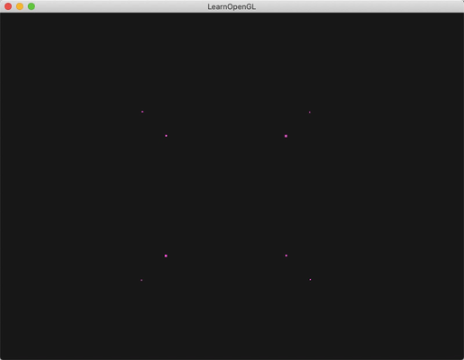
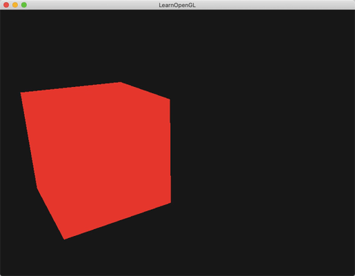

## Chapter 7 - Advanced Features
### Content Summary
This section covers chapters *29. Advanced GLSL* and **_[TO BE COMPLETED]_** of [LearnOpenGL](https://learnopengl.com).

The examples in this section show different _advanced_ features of OpenGL.

- Some interesting **vertex shader** variables are:
    - ***gl_Position***: an output variable representing the **clip-space** position.
    - ***gl_PointSize***: an output variable that can be used to set the **size of points** when they are the primitive rendered from the vertex data. Needs to be activated first.
    - ***gl_VertexID***: an input variable that contains the **ID** of the vertex being drawn.

- Some interesting **fragment shader** variables are:
    - ***gl_FragCoord***: an input variable representing the **screen coordinates** (**x** and **y**) and the **depth value** of the fragment. Can be used to apply different transformations on different parts of the screen.
    - ***gl_FrontFace***: an input boolean variable that is true if the fragment is part of a **front-facing** face and false otherwise.
    - ***gl_FragDepth***: an output variable that can be used to manually set the **depth value** of a fragment. By default, it takes the same value as *gl_FragCoord.z*. Setting this variable disables **early depth testing**, unless (from *OpenGL 4.2*) it is redeclared with a depth condition to hint some limits (like always larger or smaller than *gl_FragCoord.z*).

- Variables in shaders can be grouped together in **interface blocks** for **input** or **output** variables. They are declared in a similar way to ```structs``` but using the ```in``` or ```out``` keyword. The **block name** needs to be the same so they can be matched across shaders, their **instance name** can be different.

### Examples
The examples can be executed one by one without needing to pass any arguments, the only examples supporting an optional argument are [4. xxx](#4-xxx). The examples need to be launched from the root *build* folder so they can find the right path for the shaders. To exit the examples, just press <kbd>ESC</kbd>.

#### 1. Points in space
This example sets the variable *gl_PointSize* equal to the **depth value** when drawing points on the screen, making them appear larger the farther they are from the viewer.

<div align="center">
  <br>
  <sup><strong>Fig. 1: </strong> Growing points </sup>
</div>

#### 2. Split window
In this example, a different **color** is used in the fragment shader depending on the value of *gl_FragCoord*.

<div align="center">
  <br>
  <sup><strong>Fig. 2: </strong> A color transition </sup>
</div>

#### 3. Oriented faces
This example takes a different texture depending on the value of *gl_FrontFace*, using one for **front-facing** faces and a another for **back-facing** faces.

<div align="center">
  <br>
  <sup><strong>Fig. 3: </strong> In and out </sup>
</div>
