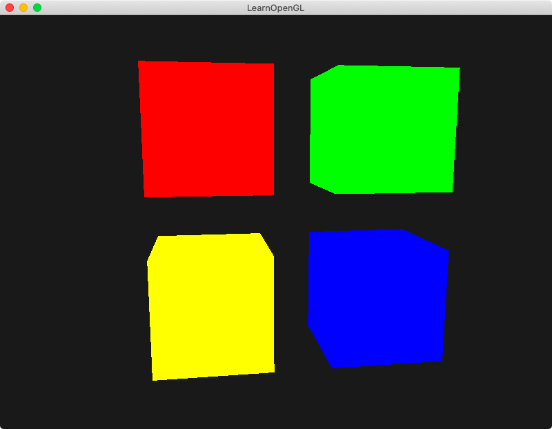
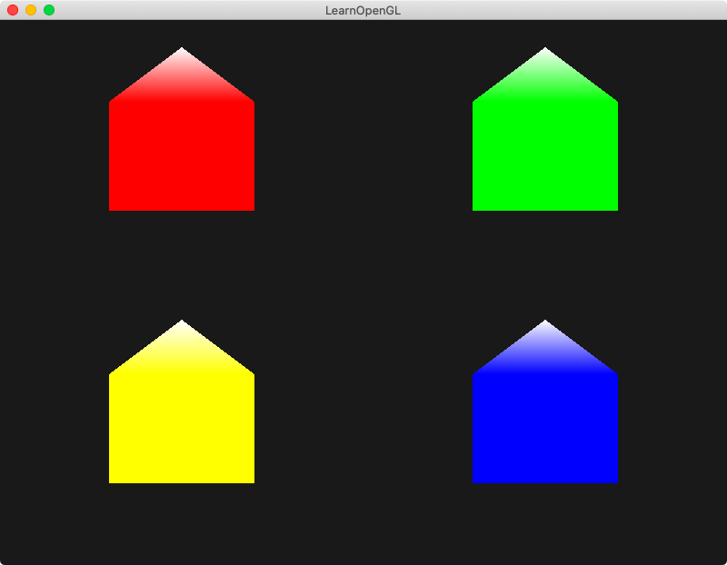
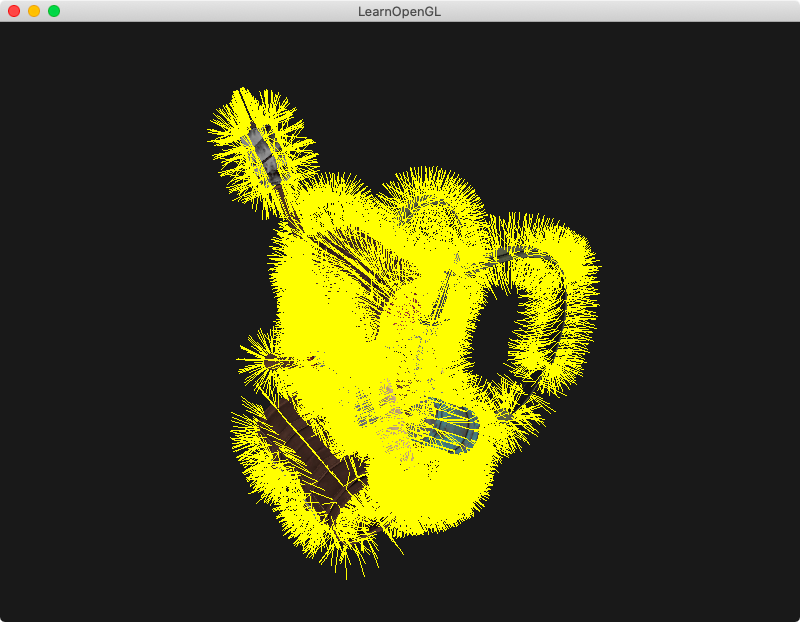
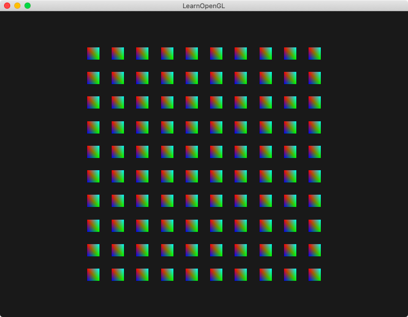
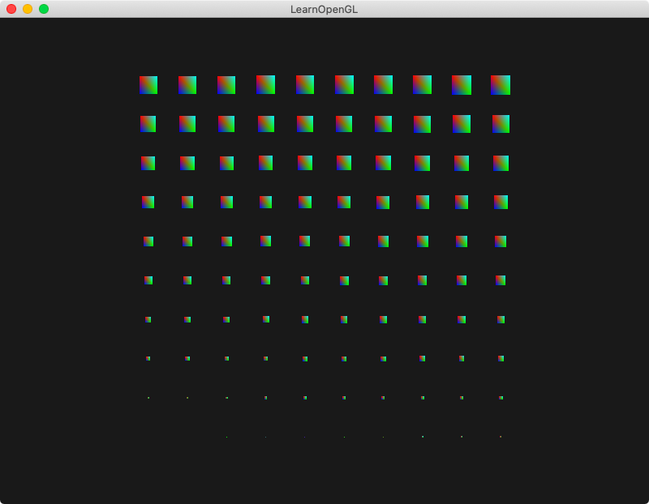
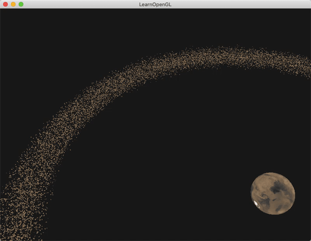
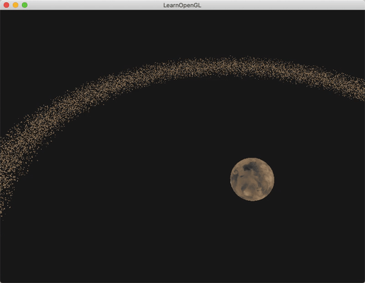

## Chapter 7 - Advanced Features
### Content Summary
This section covers chapters *29. Advanced GLSL*, *30. Geometry Shader* and **_[TO BE COMPLETED]_** of [LearnOpenGL](https://learnopengl.com).

The examples in this section show different _advanced_ features of OpenGL.

- Some interesting **vertex shader** variables are:
    - ***gl_Position***: an output variable representing the **clip-space** position.
    - ***gl_PointSize***: an output variable that can be used to set the **size of points** when they are the primitive rendered from the vertex data. Needs to be activated first.
    - ***gl_VertexID***: an input variable that contains the **ID** of the vertex being drawn.

- Some interesting **fragment shader** variables are:
    - ***gl_FragCoord***: an input variable representing the **screen coordinates** (**x** and **y**) and the **depth value** of the fragment. Can be used to apply different transformations on different parts of the screen.
    - ***gl_FrontFace***: an input boolean variable that is true if the fragment is part of a **front-facing** face and false otherwise.
    - ***gl_FragDepth***: an output variable that can be used to manually set the **depth value** of a fragment. By default, it takes the same value as *gl_FragCoord.z*. Setting this variable disables **early depth testing**, unless (from *OpenGL 4.2*) it is redeclared with a depth condition to hint some limits (like always larger or smaller than *gl_FragCoord.z*).

- Variables in shaders can be grouped together in **interface blocks** for **input** or **output** variables. They are declared in a similar way to ```structs``` but using the ```in``` or ```out``` keyword. The **block name** needs to be the same so they can be matched across shaders, their **instance name** can be different.

- **Uniform buffer objects** can be used to avoid the need to manually set the same uniform variables on different shaders (for example when using view and projection matrices). The variables need to be declared in a **uniform block** in shaders and a **uniform block layout** can be specified - *shared* by default but *std140* is most commonly used as it has a fixed set of rules for offsets and padding of variables based on multiples of a **base alignment** for each variable type. Memory needs to be allocated before filling the buffer and it also needs to be linked to a **binding point** (the whole buffer or parts of it to different binding points) so the shader can find the data (the shader also needs to have its uniform blocks linked to the same binding points as the uniform buffer objects).

- Between the vertex and fragment shaders there is another optional shader, the **geometry shader**. This shader takes the vertices of a single **primitive** (e.g. a point, a triangle) and is able to apply transformations and generate other primitives or more vertices.
    - It is important to take into account that the variables received from the **vertex shader** (position, color...) are passed as **arrays** - one element for each vertex - and that the variables which go to the **fragment shader** are sent when a vertex is **emitted**, so they need to have the right value before making the appropriate call.
    - Geometry shaders are used to dynamically generate shapes on the fly and are useful to draw simple shapes which appear multiple times on a scene in an easier way than defining all of them as vertices for the vertex shader.

- To draw multiple elements that share the same **vertex data**, the most efficient way to do it is by using **instancing**. A single render call draws as many elements as specified and it is possible to distinguish between them in the vertex shader by reading the *gl_InstanceID* variable.
    - Different data for each instance can be passed to the vertex shader using **instanced arrays**. They are defined as another vertex attribute (stored in a different vertex buffer object) that has a different **attribute divisor** from the default (0 - which updates it for every vertex). A value of 1 updates it every instance, 2 every two instances, and so on.

### Examples
The examples can be executed one by one without needing to pass any arguments except for [10. Asteroids](#10-asteroids), which requires an integer value and another optional argument. The examples need to be launched from the root *build* folder so they can find the right path for the shaders. To exit the examples, just press <kbd>ESC</kbd>.

#### 1. Points in space
This example sets the variable *gl_PointSize* equal to the **depth value** when drawing points on the screen, making them appear larger the farther they are from the viewer.

<div align="center">
  <br>
  <sup><strong>Fig. 1: </strong> Growing points </sup>
</div>

#### 2. Split window
In this example, a different **color** is used in the fragment shader depending on the value of *gl_FragCoord*.

<div align="center">
  <br>
  <sup><strong>Fig. 2: </strong> A color transition </sup>
</div>

#### 3. Oriented faces
This example takes a different texture depending on the value of *gl_FrontFace*, using one for **front-facing** faces and a another for **back-facing** faces.

<div align="center">
  <br>
  <sup><strong>Fig. 3: </strong> In and out </sup>
</div>

#### 4. Colored cubes
In this example, four different shaders are used for each cube and because view and projection matrices are the same for all of them, an **uniform buffer object** is used to store these matrices and make them available for the four shaders.

<div align="center">
  <br>
  <sup><strong>Fig. 4: </strong><i> Chis chis chis </i></sup>
</div>

#### 5. Colored houses
In this example, four houses of different colors are drawn using the **geometry shader** from just **single points** passed to the **vertex shader** with different colors associated to them. All the triangles and the extra vertices are generated in this shader.

<div align="center">
  <br>
  <sup><strong>Fig. 5: </strong> Notting Hill in winter </sup>
</div>

#### 6. Explosive backpack
This example takes the backpack model and modifies the position of its vertices in the **geometry shader**. The vertices are moved in the direction of its **normal** vector over time and then moved back to their original position in a loop fashion.

<div align="center">
  <br>
  <sup><strong>Fig. 6: </strong> Blowing up </sup>
</div>

#### 7. Look at the normal vectors
In this example, the same model is used again but this time one shader draws the model 'as is' while a second one draws **yellow lines** in the direction of each vertex's **normal**, defining them in the **geometry shader**. This is an useful *trick* for debugging.

<div align="center">
  <br>
  <sup><strong>Fig. 7: </strong> A furry backpack </sup>
</div>

#### 8. A grid of squares
This example draws multiple instances of the same square where each different position is assigned from an uniform array which value is selected using *gl_InstanceID* as index.

<div align="center">
  <br>
  <sup><strong>Fig. 8: </strong> Nothing more than a grid </sup>
</div>

#### 9. A grid of squares of different sizes
In this example, a different approach is used for drawing the grid. An **instanced array** containing the position of each instance is passed as a vertex attribute to the shader. To draw squares of different sizes, ```gl_InstanceID / 100.0``` is used as a scale factor.

<div align="center">
  <br>
  <sup><strong>Fig. 9: </strong> Growing squares </sup>
</div>

#### 10. Asteroids
This example shows the difference between drawing an element multiple times one by one and using an **instanced array**. The example draws a planet in the center and some asteroids around it. The example requires the number of asteroids to be passed as an argument and also accepts the optional argument ```--instancing``` to draw the asteroids using instanced arrays.

_**Note:** testing this without using **uniform buffer objects** for **view** and **projection** matrices made the performance of using instanced arrays much worse than drawing them one by one. After changing it, the limit for instancing was around 60000 asteroids with an acceptable frame rate while drawing them one by one had the limit at around 30000 asteroids._

<div align="center">
  <br>
  <sup><strong>Fig. 10.1: </strong> 40000 asteroids drawn one by one (not very smooth) </sup>
</div>

<div align="center">
  <br>
  <sup><strong>Fig. 10.2: </strong> 40000 asteroids drawn using an instanced array (quite smooth) </sup>
</div>
